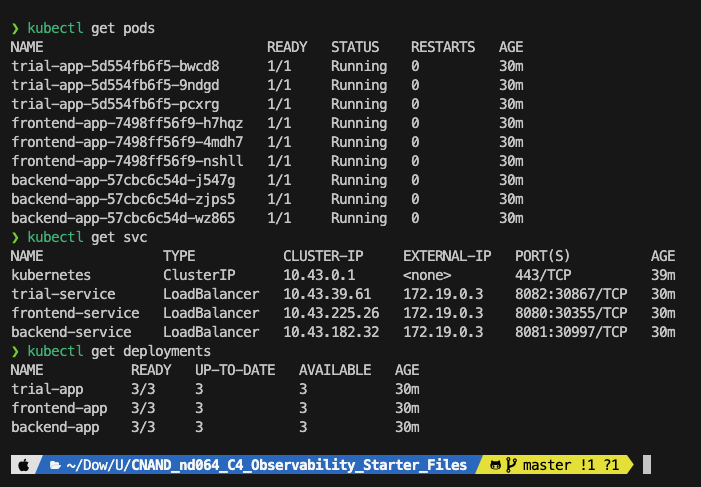
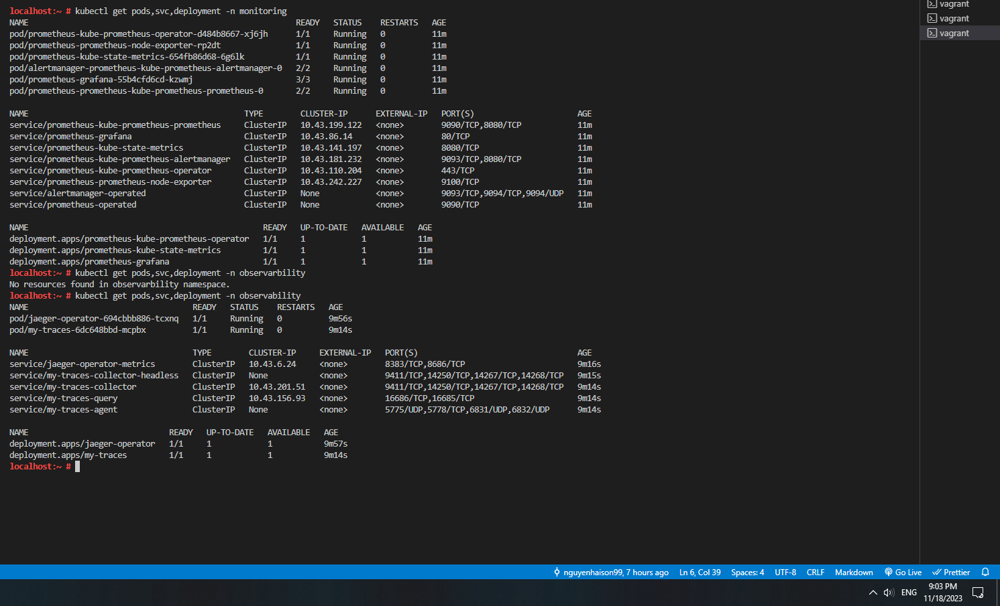
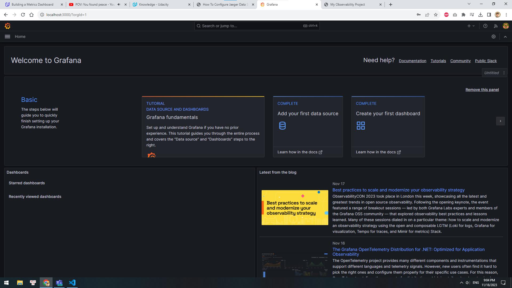
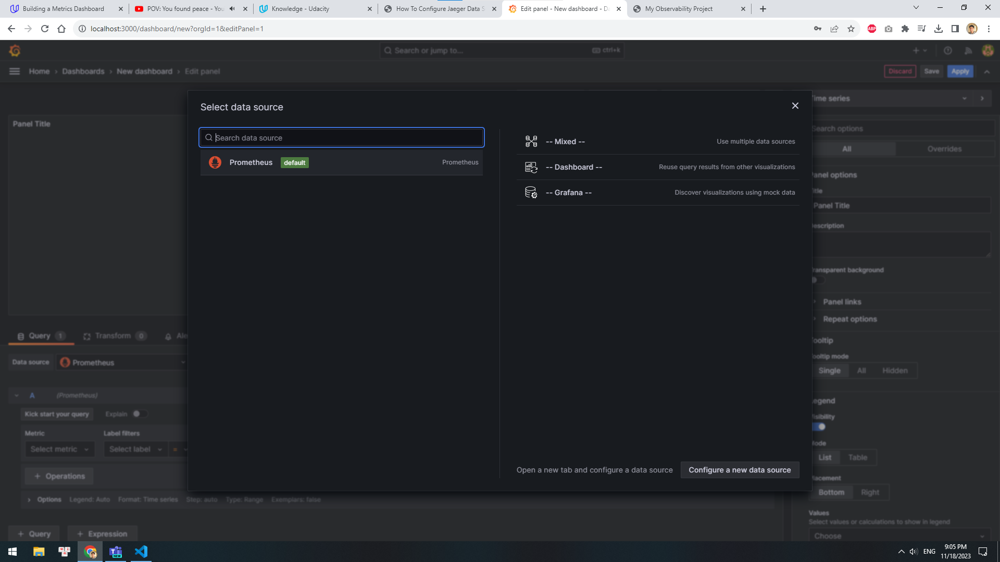
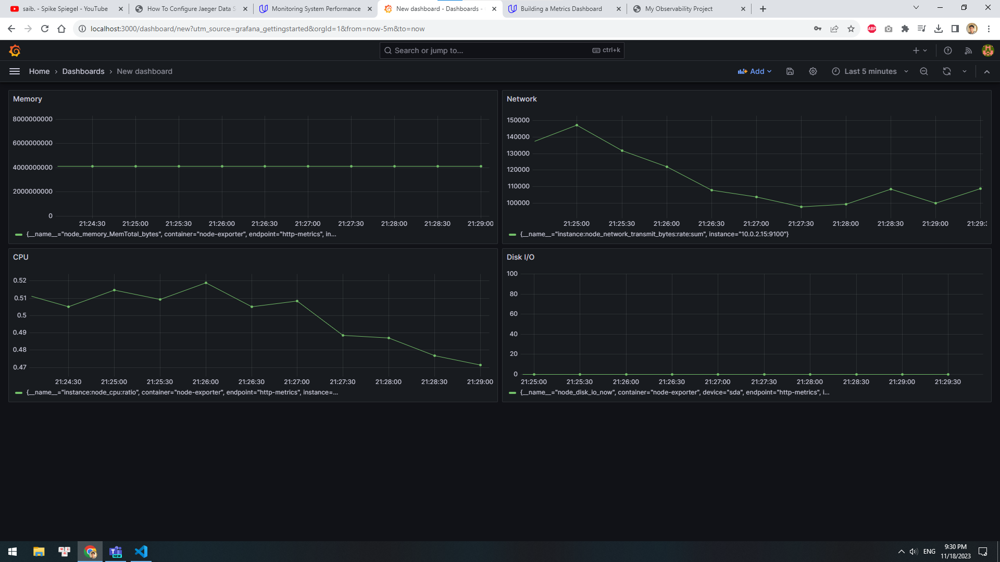
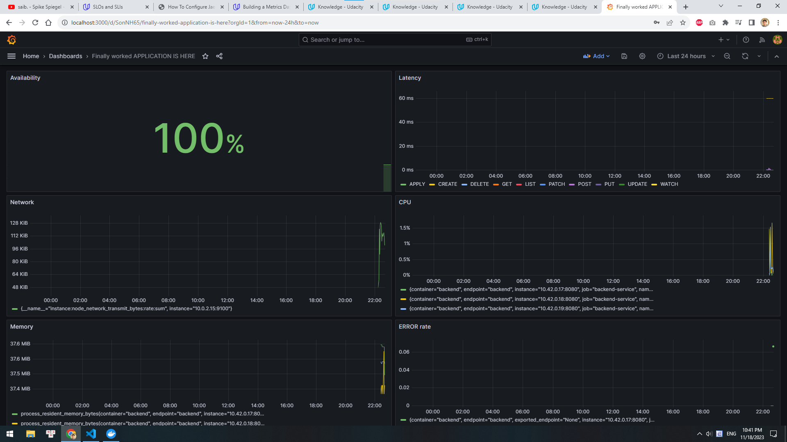
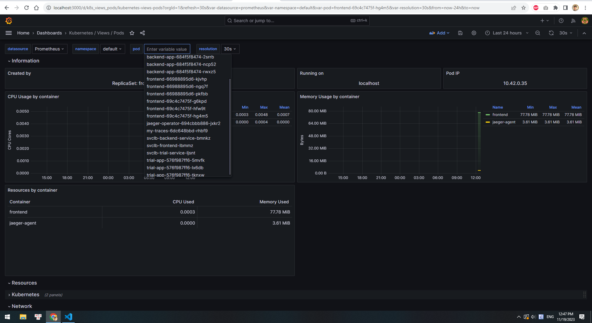
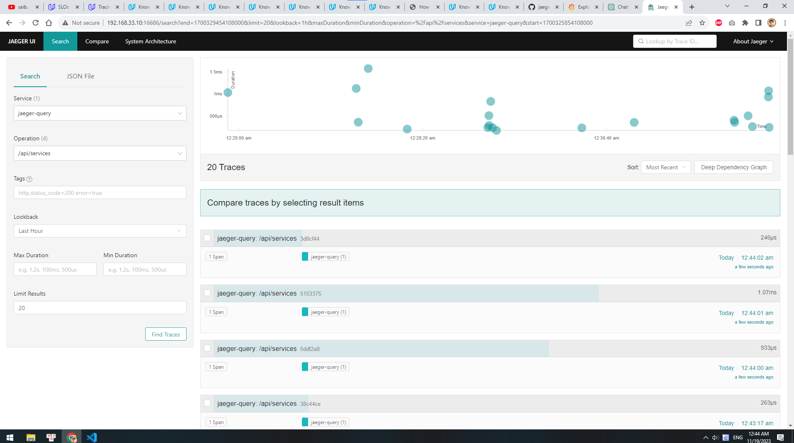
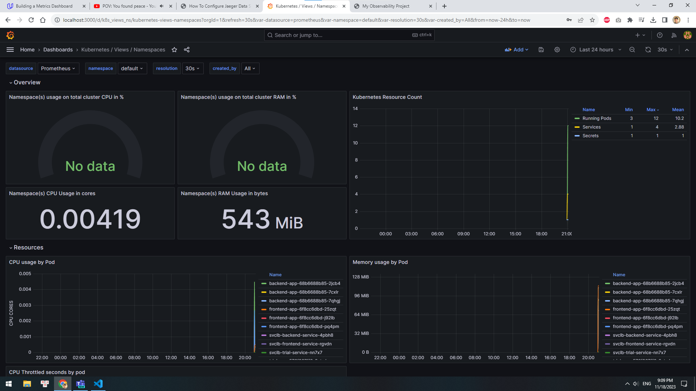

## Verify the monitoring installation

_DONE:_ run `kubectl` command to show the running pods and services for all components. Take a screenshot of the output
and include it here to verify the installation

](answer-img/kubectl-get-pod-svc-deployment.png)
pods and services of default namespace

pods and services of other namespaces

## Setup the Jaeger and Prometheus source

_DONE:_ Expose Grafana to the internet and then setup Prometheus as a data source. Provide a screenshot of the home page
after logging into Grafana.

grafana access from localhost

## Create a Basic Dashboard

_DONE:_ Create a dashboard in Grafana that shows Prometheus as a source. Take a screenshot and include it here.

## Describe SLO/SLI

_DONE:_ Describe, in your own words, what the SLIs are, based on an SLO of _monthly uptime_ and _request response time_.

The SLIs tell us that the website was up, for example, 95% of the time in the past month and that requests had an
average response time of, for example, 120ms per request. These indicators help us assess the service's performance and
meet our goals.

## Creating SLI metrics.

_DONE:_ It is important to know why we want to measure certain metrics for our customer. Describe in detail 5 metrics to
measure these SLIs.

1. **Latency**: This tells us how fast our service responds. Important because slow responses frustrate customers.
2. **Error Rate**: Measures how often our service fails. We need this to ensure our service is reliable.
3. **Uptime/Availability**: Shows how often our service is up and running. Crucial for keeping customers happy.
4. **Throughput**: Tells us how much work our service can handle. Helps us avoid overloading and crashes.
5. **Resource Utilization**: Monitors CPU and RAM usage to ensure efficient resource allocation.

## Create a Dashboard to measure our SLIs

_DONE:_ Create a dashboard to measure the uptime of the frontend and backend services We will also want to measure to
measure 40x and 50x errors. Create a dashboard that show these values over a 24 hour period and take a screenshot.

#### FEEDBACK: Front-end app monitoring added

## Tracing our Flask App

DONE:\_ We will create a Jaeger span to measure the processes on the backend. Once you fill in the span, provide a
screenshot of it here. Also provide a (screenshot) sample Python file containing a trace and span code used to perform
Jaeger traces on the backend service.

## Jaeger in Dashboards

DONE:\_ Now that the trace is running, let's add the metric to our current Grafana dashboard. Once this is completed,
provide a screenshot of it here.

## Report Error

DONE:\_ Using the template below, write a trouble ticket for the developers, to explain the errors that you are seeing (
400, 500, latency) and to let them know the file that is causing the issue also include a screenshot of the tracer span
to demonstrate how we can user a tracer to locate errors easily.

TROUBLE TICKET

Name: Hai Son

Date: 19/11/2023

Subject: Can not connect to DB

Affected Area: Backend Service

Severity: Critical

Description: We're encountering errors (400, 500) and high latency in our backend service. Errors are likely due to data
validation issues, and latency is affecting user experience. The affected file is `app.py`

## Creating SLIs and SLOs

DONE: We want to create an SLO guaranteeing that our application has a 99.95% uptime per month. Name four SLIs that you
would use to measure the success of this SLO.

To ensure 99.95% uptime, we use four key SLIs:

1. **Uptime:** Target: 99.95%
2. **Error Rate:** Target: < 0.1%
3. **Latency:** Target: < 200ms
4. **Regional Availability:** Consistent high availability.

## Building KPIs for our plan

DONE: Now that we have our SLIs and SLOs, create a list of 2-3 KPIs to accurately measure these metrics as well as a
description of why those KPIs were chosen. We will make a dashboard for this, but first write them down here.

**Uptime SLI:**

1. Uptime Percentage
   - Measures actual uptime (99.95% SLO).
2. Downtime Incidents
   - Tracks incident frequency.
3. Downtime Duration
   - Measures incident impact duration.

**Error Rate SLI:**

1. Error Rate
   - Tracks error rate (< 0.1%).
2. Error Resolution Time
   - Measures error resolution speed.
3. Error Types
   - Categorizes and tracks error types.

**Response Time SLI:**

1. Response Time (Latency)
   - Monitors average response time (< 200ms).
2. Peak Latency
   - Identifies peak response time.
3. Geographic Latency
   - Analyzes regional response time.

## Final Dashboard

DONE: Create a Dashboard containing graphs that capture all the metrics of your KPIs and adequately representing your
SLIs and SLOs. Include a screenshot of the dashboard here, and write a text description of what graphs are represented
in the dashboard.

### Grafana Dashboard Overview

- **CPU % Usage (Namespace)**: Should show CPU % used by namespaces.
- **RAM % Usage (Namespace)**: Should show RAM % used by namespaces.
- **CPU Usage (Namespace)**: Total CPU used by all namespaces.
- **RAM Usage (Namespace)**: Total RAM used by all namespaces.
- **Resource Count (Kubernetes)**: Shows how many Pods, Services, and Secrets over time.
- **CPU Usage (Pod)**: Graph of CPU use for each pod, in cores, over time.
- **Memory Usage (Pod)**: Graph of Memory use for each pod, in MiB, over time.
- **CPU Throttled (Pod)**: Shows seconds each pod’s CPU was throttled.
