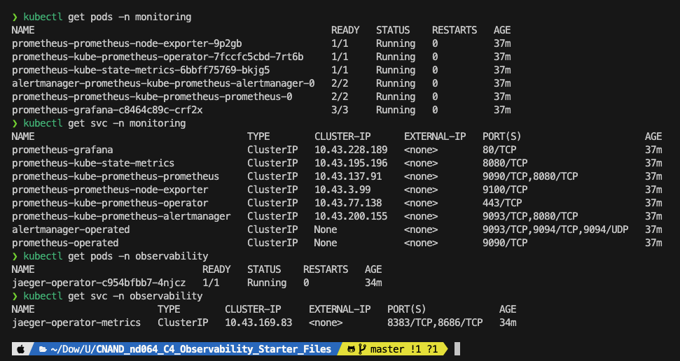
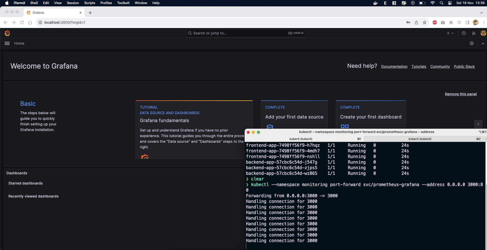
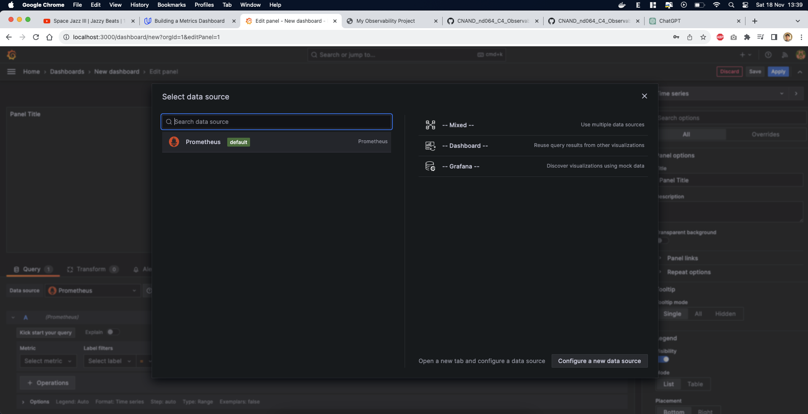
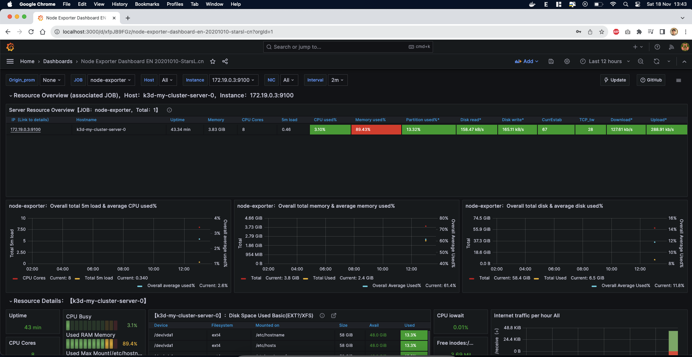
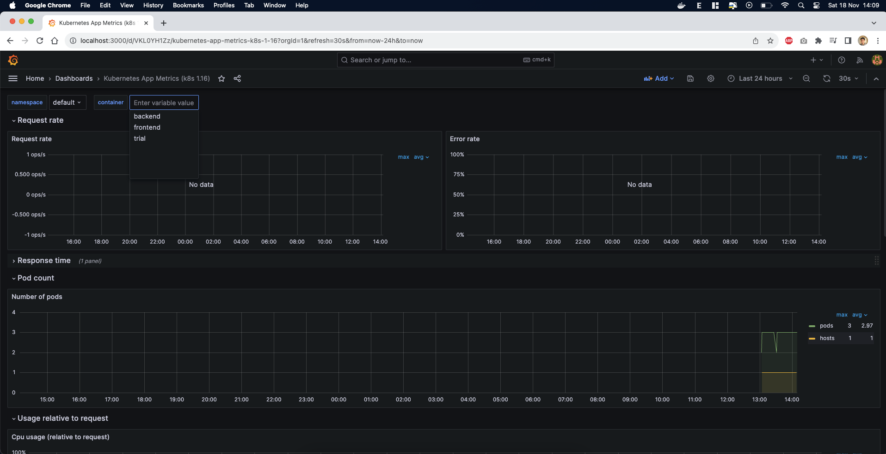

## Using MacOS M1 and have Docker installed.

Instead of using Vagrant and K3s, I'll be using k3d, which deploys K3s as containers.

To deploy k3d, you can use the following commands:

```bash
k3d cluster create my-cluster --servers 1 --agents 0 --port 8080:80@loadbalancer --port 6443:6443@loadbalancer

k3d kubeconfig merge my-cluster --kubeconfig-switch-context
```

## Verify the monitoring installation

*DONE:* run `kubectl` command to show the running pods and services for all components. Take a screenshot of the output and include it here to verify the installation


pods and services of default namespace



pods and services of other namespaces

## Setup the Jaeger and Prometheus source
*DONE:* Expose Grafana to the internet and then setup Prometheus as a data source. Provide a screenshot of the home page after logging into Grafana.

grafana access from localhost


prometheus as source

## Create a Basic Dashboard
*DONE:* Create a dashboard in Grafana that shows Prometheus as a source. Take a screenshot and include it here.


## Describe SLO/SLI
*DONE:* Describe, in your own words, what the SLIs are, based on an SLO of *monthly uptime* and *request response time*.

The SLIs tell us that the website was up, for example, 95% of the time in the past month and that requests had an average response time of, for example, 120ms per request. These indicators help us assess the service's performance and meet our goals.

## Creating SLI metrics.
*DONE:* It is important to know why we want to measure certain metrics for our customer. Describe in detail 5 metrics to measure these SLIs. 

1. **Latency**: This tells us how fast our service responds. Important because slow responses frustrate customers.
2. **Error Rate**: Measures how often our service fails. We need this to ensure our service is reliable.
3. **Uptime/Availability**: Shows how often our service is up and running. Crucial for keeping customers happy.
4. **Throughput**: Tells us how much work our service can handle. Helps us avoid overloading and crashes.
5. **Resource Utilization**: Monitors CPU and RAM usage to ensure efficient resource allocation.


## Create a Dashboard to measure our SLIs
*DONE:* Create a dashboard to measure the uptime of the frontend and backend services We will also want to measure to measure 40x and 50x errors. Create a dashboard that show these values over a 24 hour period and take a screenshot.


## Tracing our Flask App
*TODO:*  We will create a Jaeger span to measure the processes on the backend. Once you fill in the span, provide a screenshot of it here. Also provide a (screenshot) sample Python file containing a trace and span code used to perform Jaeger traces on the backend service.

## Jaeger in Dashboards
*TODO:* Now that the trace is running, let's add the metric to our current Grafana dashboard. Once this is completed, provide a screenshot of it here.

## Report Error
*TODO:* Using the template below, write a trouble ticket for the developers, to explain the errors that you are seeing (400, 500, latency) and to let them know the file that is causing the issue also include a screenshot of the tracer span to demonstrate how we can user a tracer to locate errors easily.

TROUBLE TICKET

Name:

Date:

Subject:

Affected Area:

Severity:

Description:


## Creating SLIs and SLOs
*TODO:* We want to create an SLO guaranteeing that our application has a 99.95% uptime per month. Name four SLIs that you would use to measure the success of this SLO.

## Building KPIs for our plan
*TODO*: Now that we have our SLIs and SLOs, create a list of 2-3 KPIs to accurately measure these metrics as well as a description of why those KPIs were chosen. We will make a dashboard for this, but first write them down here.

## Final Dashboard
*TODO*: Create a Dashboard containing graphs that capture all the metrics of your KPIs and adequately representing your SLIs and SLOs. Include a screenshot of the dashboard here, and write a text description of what graphs are represented in the dashboard.  
